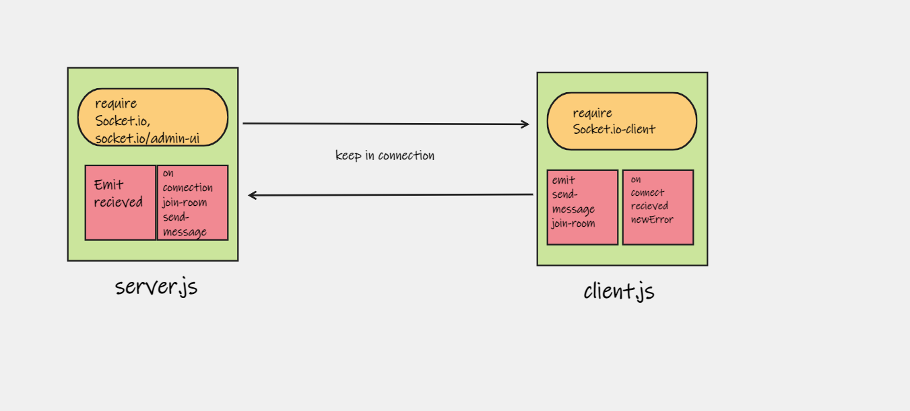

# Message-Queues
Creating an application for sending and receiving messages, for specific user or for everyone.

1. The name of the application.
   Message-Queues
2. Full description about what the application does.
   this is the back -end part of real-time chat application, sending and recieving messages, joining chat-rooms, and broadcast for all users.
3. Explain how you built the application and what technologies you used (also mention the libraries and tools).
   built the app using socket-io, and socket.io/admin-ui (namespace) 

4. Explain how the application work (how you can run it & use it) .
   by sending a message and send it using the id for each client

note: I struggeled in testing the app, and in check the implementation without the front-end part, I tried to not add it. and I couldn't deploy it

## UML diagram

**The Pull request:**

